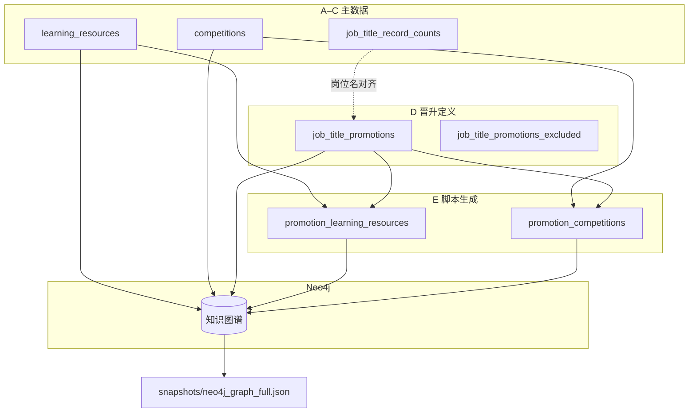

# datasets 数据目录说明

本目录存放 **PathFy-Uni 职业规划知识图谱** 的结构化 CSV、生成结果与 schema 文档。数据经 `tools/csv/` 加工后，由 `tools/neo4j/` 导入远程 Neo4j，供后端报告、岗位推荐、晋升路径等能力使用。

## 目录结构

```
datasets/
├── README.md                 # 本说明
├── master/                   # 主数据（手工维护）
│   ├── job_title_record_counts.csv
│   ├── learning_resources.csv
│   ├── competitions.csv
│   ├── job_title_lateral_transfer.csv      # 水平换岗相似（脚本生成）
│   └── job_title_lateral_transfer_schema.md
├── promotion/                # 晋升路线与推荐（含生成表）
│   ├── job_title_promotions.csv
│   ├── job_title_promotions_excluded.csv
│   ├── promotion_learning_resources.csv   # 脚本生成
│   ├── promotion_competitions.csv         # 脚本生成
│   ├── job_title_promotions_schema.md
│   └── job_title_promotion_recommendations_schema.md
└── snapshots/
    └── neo4j_graph_full.json              # 全库导出快照
```

招聘原始 Excel（如 `20260226105856_457.xls`）可放本目录根下仅本地使用，勿提交含隐私文件。

---

## 一、分类总览

| 分类 | 路径 | 行数（约） | 角色 |
|------|------|------------|------|
| **A. 岗位统计** | `master/job_title_record_counts.csv` | 51 | 招聘库岗位分布，晋升/资源锚定基准 |
| **B. 学习资源主表** | `master/learning_resources.csv` | 631 | 慕课/文档/练习，图谱 `LearningResource` 源 |
| **C. 竞赛主表** | `master/competitions.csv` | 84 | 学科/双创竞赛，图谱 `Competition` 源 |
| **D. 晋升路线** | `promotion/job_title_promotions.csv` | 76 | 49 岗位 × 多路线，`JobPromotion` 源 |
| **D. 晋升排除** | `promotion/job_title_promotions_excluded.csv` | 2 | 暂不配置路线及原因 |
| **E. 晋升×资源（生成）** | `promotion/promotion_learning_resources.csv` | 1216 | 路线分阶段推荐学习资源 |
| **E. 晋升×竞赛（生成）** | `promotion/promotion_competitions.csv` | 340 | 路线分阶段推荐竞赛 |
| **F. 图谱快照** | `snapshots/neo4j_graph_full.json` | — | 全库导出（约 47MB） |
| **G. 字段说明** | `promotion/job_title_promotions_schema.md` | — | 晋升主表字段与命名 |
| **G. 字段说明** | `promotion/job_title_promotion_recommendations_schema.md` | — | 推荐生成与导入逻辑 |
| **H. 水平换岗相似** | `master/job_title_lateral_transfer.csv` | 408 | JobTitle 间 `SIMILAR_FOR_LATERAL`（生成） |



---

## 二、A. 岗位统计

### `master/job_title_record_counts.csv`

招聘数据聚合后的 **51 个 JobTitle** 统计（与图谱岗位名一致）。

| 列 | 说明 |
|----|------|
| `rank` | 按 `record_count` 排序 |
| `job_title` | 岗位名称（与 `JobTitle.name` 一致） |
| `record_count` | 该岗位关联招聘记录条数 |
| `pct_of_total` | 占总量百分比 |
| `company_count` | 涉及公司数 |
| `job_code_count` | 岗位编码种类数 |

**用途：** 校验 `job_title` 拼写；理解资源/竞赛覆盖优先级（Java、实施工程师等头部岗位记录最多）。

**与晋升表关系：** 49 个岗位有晋升路线；以下 2 个仅在统计表出现，见 `promotion/job_title_promotions_excluded.csv`：

- `总助/CEO助理/董事长助理`
- `储备经理人`

---

## 三、B. 学习资源主表

### `master/learning_resources.csv`

| 列 | 说明 |
|----|------|
| `resource_id` | 主键，如 `Java_1`、`job_interview1` |
| `job_name` | 适用岗位；`|` 表示多岗位共用；**`ALL`** 表示全岗位通用 |
| `resource_name` | 资源标题 |
| `resource_desc` | 简介 |
| `resource_url` | 链接（慕课/官方文档/练习平台） |
| `resource_type` | `视频课程` / `文档教程` / `在线练习` |
| `difficulty` | `入门` / `进阶` |
| `source` | 来源平台 |
| `skill_tag` | 技能标签 |

**规模（当前）：**

| 指标 | 数值 |
|------|------|
| 总行数 | 631 |
| `job_name` 字段种类 | 52（含 `ALL`） |
| 视频课程 / 文档教程 / 在线练习 | 402 / 226 / 3 |
| 通用面试资源 `job_interview1`–`10` | 10（`job_name=ALL`） |

**命名约定：** `{岗位名}_{序号}`，同岗位多资源递增编号；通用面试资源前缀 `job_interview`。

**图谱：** `(LearningResource {resource_id})-[:FOR_JOB_TITLE]->(JobTitle)`；`ALL` 导入时连至全部 JobTitle。

```bash
python tools/csv/validate_learning_resource_urls.py
python tools/neo4j/sync_neo4j_learning_resources.py
```

---

## 四、C. 竞赛主表

### `master/competitions.csv`

| 列 | 说明 |
|----|------|
| `competition_id` | 主键，如 `comp_001` |
| `job_name` | 适用岗位，`|` 分隔多岗位 |
| `competition_name` | 竞赛名称 |
| `competition_desc` | 说明 |
| `official_url` | 官网 |
| `competition_type` | 如创新创业、程序设计、数学建模 |
| `organizer` | 主办方 |
| `target_audience` | 面向人群 |
| `team_mode` | 个人/团队 |
| `frequency` | 举办频率 |
| `difficulty` | 入门 / 进阶 / 高阶 |
| `cap_tags` | 能力维度标签（`|` 分隔） |
| `skill_tags` | 技能标签 |
| `award_level` | 如国家级 |

**规模：** 84 条竞赛；`job_name` 展开后覆盖 **22** 个 JobTitle（远少于 51，晋升推荐中销售/法务等路线常无竞赛行）。

```bash
python tools/csv/validate_competition_urls.py
python tools/neo4j/sync_neo4j_competitions.py
```

---

## 五、D. 晋升路线定义

### `promotion/job_title_promotions.csv`

每条记录 = 一条 **JobPromotion** 晋升路线（同岗位可多路线）。

| 列 | 必填 | 说明 |
|----|------|------|
| `promotion_id` | 是 | `{岗位}_promotion{N}`；`/` 在 id 中写作 `_`（如 `C_C++_promotion1`） |
| `job_title` | 是 | 锚定 `JobTitle.name` |
| `title` | 是 | 路线短标题（前端展示） |
| `promotion` | 是 | 完整三段文案，` → ` 连接 |
| `stage1` / `stage2` / `stage3` | 是 | 各阶段目标称谓；L3 可多选 ` / ` |
| `stage3_job_title` | 否 | L3 若对应已有 JobTitle 则填写 |
| `notes` | 否 | 维护备注 |

**规模：** 76 行路线，覆盖 **49** 个 `job_title`（部分岗位 2–3 条路线，如 Java、C/C++、测试工程师）。

### `promotion/job_title_promotions_excluded.csv`

| 列 | 说明 |
|----|------|
| `job_title` | 排除岗位 |
| `exclude_reason` | 不配置路线原因 |

详见 [`promotion/job_title_promotions_schema.md`](promotion/job_title_promotions_schema.md)。

```bash
python tools/neo4j/sync_neo4j_job_promotions.py
```

---

## 六、E. 晋升推荐关联（生成数据）

由 `tools/csv/build_promotion_recommendations_csv.py` 根据 **D + B + C** 自动生成，勿手改后长期分叉（应改主表或脚本后重跑）。

### `promotion/promotion_learning_resources.csv`

| 列 | 说明 |
|----|------|
| `promotion_id` | 对应 JobPromotion |
| `job_title` | 锚定岗位 |
| `stage` | `1` / `2` / `3` |
| `stage_role` | 该阶段称谓 |
| `resource_id` | LearningResource 主键 |
| `resource_name` | 冗余便于核对 |
| `difficulty` / `resource_type` / `skill_tag` | 资源属性副本 |
| `score` | 0–1 推荐分 |
| `rank` | 同 `promotion_id` + `stage` 内排序 |
| `rationale` | 推荐依据 |

**规模：** 1216 行；唯一 `(promotion_id, resource_id)` **899** 对（同一资源多 stage 在 CSV 多行）。

**每路线配额：** stage1/2/3 各最多 5/5/4 条岗位资源 + stage3 额外 2 条 `job_interview*`（按路线语境打分，非固定 id）。

### `promotion/promotion_competitions.csv`

| 列 | 说明 |
|----|------|
| `promotion_id` | 对应 JobPromotion |
| `job_title` | 锚定岗位 |
| `stage` | `2` 或 `3` |
| `stage_role` | 阶段称谓 |
| `competition_id` | Competition 主键 |
| `competition_name` | 冗余 |
| `difficulty` / `competition_type` / `award_level` | 属性副本 |
| `score` / `rank` | 推荐分与排序 |
| `match_via` | 直链或赛道扩展说明 |
| `rationale` | 推荐依据 |

**规模：** 340 行；唯一 `(promotion_id, competition_id)` **216** 对。

详见 [`promotion/job_title_promotion_recommendations_schema.md`](promotion/job_title_promotion_recommendations_schema.md)。

```bash
python tools/csv/build_promotion_recommendations_csv.py
python tools/neo4j/sync_neo4j_promotion_recommendations.py
```

**图谱注意：** `RECOMMENDS_*` 按 `(JobPromotion, 资源/竞赛)` MERGE，**不含 `stage`**，故 CSV 多 stage 在图中合并为一条边（属性为最后一次写入的 stage）。

---

## 七、F. 图谱快照

### `snapshots/neo4j_graph_full.json`

| 字段 | 说明 |
|------|------|
| `meta` | 库名、导出时间、节点/关系总数 |
| `nodes` | 全节点（含 `Job`、`Skill`、`JobTitle` 等） |
| `relationships` | 全关系 |

当前快照约 **31078** 节点、**74077** 关系（导出时间见文件内 `exported_at_utc`）。体积约 **47MB**，适合离线分析；**非** 日常导入源（日常用 CSV + sync 脚本增量维护）。

生成参考：`backend/tools/analyze_neo4j_graph.py` 或自建导出脚本。

---

## 八、推荐维护流程

```
1. 改主表 CSV（`master/*`、`promotion/job_title_promotions.csv`）
2. python tools/csv/validate_*_urls.py          # 可选
3. python tools/csv/build_promotion_recommendations_csv.py
4. python tools/neo4j/sync_neo4j_*.py           # 按 tools/README.md 顺序
5. python tools/neo4j/check_neo4j_duplicates.py # 可选：查重复边
```

---

## 九、与 Neo4j 实体对照

| 数据集 | 节点/关系 |
|--------|-----------|
| `master/learning_resources.csv` | `LearningResource`，`FOR_JOB_TITLE` → `JobTitle` |
| `master/competitions.csv` | `Competition`，`FOR_JOB_TITLE` → `JobTitle` |
| `promotion/job_title_promotions.csv` | `JobPromotion`，`FOR_JOB_TITLE` → `JobTitle` |
| `promotion/promotion_learning_resources.csv` | `RECOMMENDS_RESOURCE` → `LearningResource` |
| `promotion/promotion_competitions.csv` | `RECOMMENDS_COMPETITION` → `Competition` |
| 招聘导入（`generate_graph/`） | `Job`，`HAS_TITLE` → `JobTitle`，`VERTICAL_UP` 等 |

---

## 十、安全与 Git 协作

### 禁止提交

| 类型 | 示例 | 原因 |
|------|------|------|
| MySQL 全库导出 | `suilli_mizi.sql` | 含密码哈希、邮箱、简历 |
| 脱敏前 dump | `*.dump`、`backup/*.sql` | 同上 |
| SSH 私钥 | `*.pem`、`id_rsa` | 凭证 |

`.gitignore` 已忽略 `datasets/**/*.sql` 等；**勿**将含隐私的 dump 放入本目录并提交。

### 允许提交

- 本目录下 **CSV / schema.md**（无用户账号与简历正文）
- `snapshots/neo4j_graph_full.json` 若不含隐私可提交；体积大时建议本地保留或 Git LFS

### 初始化数据库

不要用 `datasets/*.sql` 灌库，请使用：

```bash
mysql -u ... -p suilli_mizi < backend/schema.sql
# 再按序执行 backend/migrations/002–005（见 backend/tools/run_migration_*.py）
```

### 误提交隐私文件

1. 从历史中移除（`git filter-repo` / BFG）  
2. 通知用户改密、轮换 API Key  
3. 协作材料中对邮箱、简历打码  

---

## 十一、文档索引

| 文档 | 内容 |
|------|------|
| [promotion/job_title_promotions_schema.md](promotion/job_title_promotions_schema.md) | `promotion_id` 命名、字段、Neo4j 导入 |
| [promotion/job_title_promotion_recommendations_schema.md](promotion/job_title_promotion_recommendations_schema.md) | 推荐打分逻辑、已知缺口 |
| [../tools/README.md](../tools/README.md) | 脚本目录与同步顺序 |

---

## 十二、已知数据缺口（摘要）

| 缺口 | 说明 |
|------|------|
| 竞赛覆盖 | 仅 22 个 JobTitle 有直链竞赛，约 8 条晋升路线可能无 `promotion_competitions` 行 |
| 晋升排除 | 2 个岗位无 `job_title_promotions` 行 |
| 图谱 MERGE | `RECOMMENDS_*` 不区分 stage，图边数少于 CSV 行数属预期 |
| 大文件 | `snapshots/neo4j_graph_full.json` 与生产图可能不同步，以 sync 后库为准 |
