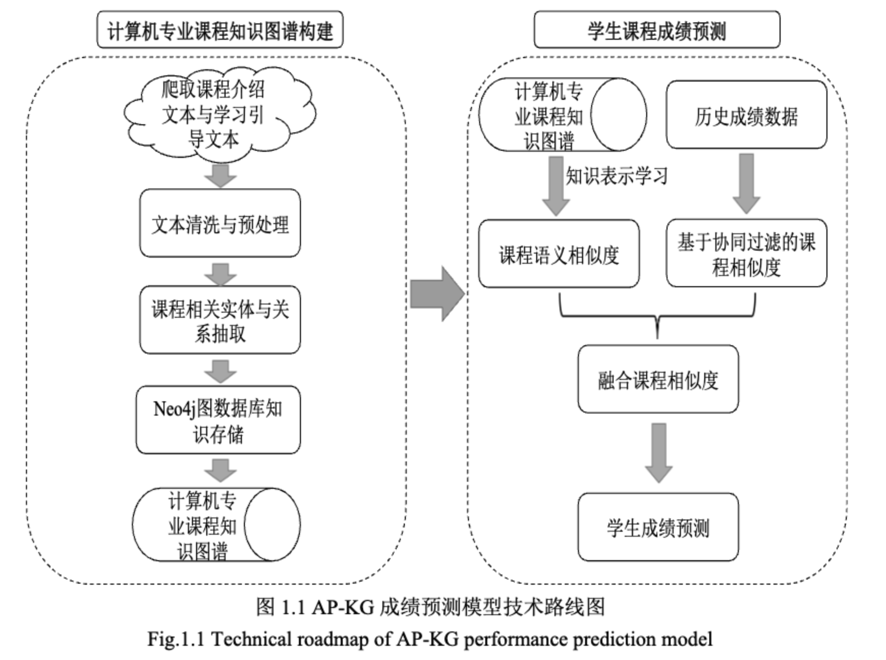
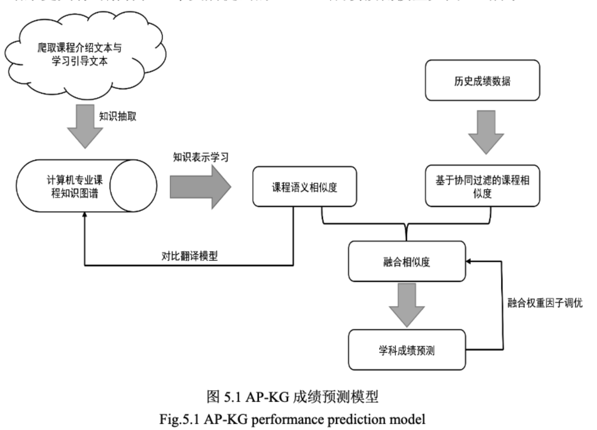
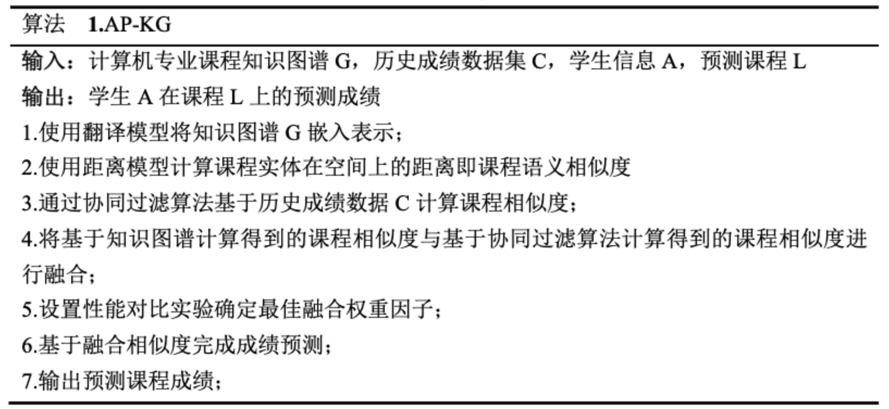

# 基于知识图谱的个性化在线课程推荐方法

[原文链接](https://kns.cnki.net/kcms2/article/abstract?v=SQKXI91EiTpbTTBKhmGZNkgMcpt6hhCAkiIReA4GGYR5BTJ21-pm4Qmp2G1a1-97ODzkVPk6sYPyawsSLfRo0jQq9KxnhR3gif7Mhs2TNPvYjFQQLsHtSrSXBLROy4enwlIaifbLnis&uniplatform=NZKPT&captchaId=7277984a-eb3f-41f2-b8a7-1f6ac5c2c933)

数据集：MOOC 网站爬取的课程介绍和学习引导文本，用机器学习方法抽取知识点、参考书籍和课程先后修关系，基于 Neo4j 建立知识图谱。基于上述知识图谱提出成绩预测方法。

## 绪论

### 研究背景

指出传统方法有一个明显的弊端——滞后性强，只能在挂科之后做出相应，不能**提前预警**。

构建知识图谱主要分为三大部分：

- **构建知识体系**：把外接信息与数据联系起来
- **知识抽取**：包括实体识别和关系抽取
  - **实体识别**：用自然语言处理方法从文本信息中识别出命名的主体
  - **关系抽取**：用机器学习方法从文本信息中抽取出实体之间的对应关系
- **利用知识提供服务**：知识图谱的应用。

### 这篇论文的研究内容

现有成绩预警的重心在于历史成绩和行为数据，但是未使用**课程之间的语义相关性**。这篇文章提了于知识图谱增强的协同过滤学生成绩预测模型。



## 计算机专业课程知识图谱构建

### 预处理

用 **Scrapy** 对课程介绍文本和学习引导介绍文本进行爬取。取出停用词之后用 **Jieba** 分词，在分词时加入了自行构建的计算机专业名词表提升精度。

```text
SAX 技术，Java 语言，操作 XML 文档，SQL 语言，检索，数据库设计，数据库应用系统，并发控制，查询处理，数据库优化，
HTM服务器控件，内部对象，类与对象，控制语句，网络编程，异步多线程，XML，Web 服务，bug，白盒测试，黑盒测试，功能测试，
大数据处理平台，数据管理，分布式存储，分布式计算，分布式存储框架 HDFS，分布式计算框架 MapReduce，集群安装配置，
I/O操作，HBase 基本应用，Hive 基本应用，Hadoop 架构
```

## 课程实体和关系抽取

### TF-IDF

Term Frequency-Inverse Document Frequency, 文本挖掘的一种加权算法

TF(Term Frequency) 特定词语在特定文章出现的总次数，一个文件中的特定词个数 / 总词数。

$$
Sf_{i, j} = \delta_{i, j} / \sum_{k}\delta_{i, j}
$$

IDF(Inverse Documnet Frequency) 特定单词对于整个语料库的重要程度指标，log(文档数/特定词出现的文档数)。

$$
idf_i = \log \frac{|D|}{|j\cdot s_i \in d_j|}
$$

TF-IDF 值是上述两个值相乘。

$$
Sf_{i, j}idf_i = Sf_i \cdot idf
$$

### 实体和关系抽取

- **知识点抽取**：上一部清洗之后的数据作为文档，取 TF-IDF 值最高的二十个作为核心知识点。
- **参考书籍**：书名号，顺序标识（`(1)`, `(A)`, `(上册)`...）
- **先后关系**：正则表达式，主要根据课程标题的顺序关系 `（上册）->（下册）`


### 知识存储

使用 Neo4j 数据库，确定了如下实体:“课程名称”、“知识点”、“参考书籍”、“先修课程”。

## 课程知识图谱表示学习

- **三元组**:（头实体，关系，尾实体）
- **正三元组**：真实的数据
- **负三元组**：对头尾实体进行随机替换后的三元组

最大间隔法

$$
\begin{align}
    d(h, r, t) = \| (h_r + r) - t_r \|_2^2 = \| (M_r h + r) - M_r t \|_2^2 \approx 0\\
    \delta = \sum_{(h,r,t) \in T} \sum_{(h',r,t') \in T'} \max(0, \lambda + d(h, r, t) - d(h', r, t'))
\end{align}
$$

### 实验与分析

评价指标，MRR 指数越大越好

$$
MRR(T_{test}) = \frac{1}{|T_{test}|} \sum_{(h^+, r, t^+) \in T_{test}} \frac{1}{rank(h^+, r, t^+)} \tag{5.11}
$$

## 基于知识图谱的成绩预测方法

模型示意图



算法流程



### 相似度

#### 基于课程

在计算课程语义相似度时，选择**欧几里得距离**，计算公式为：

$$
d(L_i, L_j) = \sqrt{\sum_{k=1}^{g} (V_{ki} - V_{kj})^2} \tag{5.2}
$$

为了计算的统一性，本文对其进行归一化处理：

$$Sim_{KG}(i, j) = \frac{d(L_i, L_j) - \mu(d)}{\sigma(d)} \tag{5.3}$$

$Sim_{KG}(i, j)$ 的值越大，则说明课程实体 $L_i$ 与课程实体 $L_j$ 具有越高的相似度。

课程的平均欧几里得距离 $\mu(d)$ 和方差 $\sigma^2(d)$ 计算公式如式 (5.4) 与式 (5.5) 所示：

$$\mu(d) = \frac{1}{T} \sum_{r=1}^{T} d(L_i, L_r) \tag{5.4}$$

$$\sigma^2(d) = \frac{1}{T} \sum_{r=1}^{T} (d(L_i, L_r) - \mu(d))^2 \tag{5.5}$$

其中，$T$ 是课程总数。

#### 基于历史成绩

$$
Sim_{CF}(i, j) = \cos(\vec{L_i}, \vec{L_j}) = \frac{\vec{g_i} \cdot \vec{g_j}}{\|\vec{g_i}\| \times \|\vec{g_j}\|} = \frac{\sum_{k=1}^{S} T_{ki} \times T_{kj}}{\sqrt{\sum_{k=1}^{S} T_{ki}^2} \times \sqrt{\sum_{k=1}^{S} T_{kj}^2}} \tag{5.6}
$$

$Sim_{CF}(i, j)$ 表示课程 $i$ 与课程 $j$ 之间的协同过滤相似度；$\vec{g_i}$ 和 $\vec{g_j}$ 分别表示课程对应的特征向量；$T_{ki}$ 表示向量中的分量，$S$ 为特征维度。

#### 融合相似度

$$
Sim(i, j) = \sigma \cdot Sim_{KG}(i, j) + (1 - \sigma)\cdot Sim_{CF}(i, j)
$$

$\sigma$ 选取需要实验。

### 成绩预测

$$
P_{AL} = \frac{\sum_{i \in C(L,K) \cap G(A)} (g_{Ai} \times Sim(L, i))}{\sum_{i \in C(L,K) \cap G(A)} Sim(L, i)}
$$

### 实验与分析

评价指标。

$$
\begin{align}
    RMSE(C_{test}) = \sqrt{\frac{1}{|C_{test}|} \sum_{p \in C_{test}} (p' - p)^2}\\
    MAE(C_{test}) = \frac{1}{|C_{test}|} \sum_{p \in C_{test}} |p' - p|
\end{align}
$$